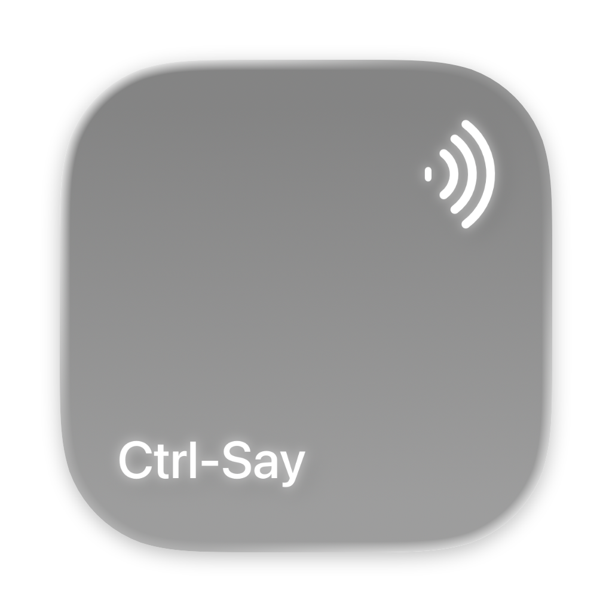

<p align="center">
  
</p>

<h1 align="center">Ctrl-Say</h1>

<p align="center">
  <strong>Copy once. Paste by name.</strong><br>
  A native macOS clipboard app that turns spoken names and numbers into fast, reusable copy-and-paste slots.
</p>

<p align="center">
  On-device speech &nbsp;&middot;&nbsp; Native clipboard fidelity &nbsp;&middot;&nbsp; Local-first
</p>

## Why Ctrl-Say

Copying several disconnected pieces of information usually means repeatedly returning to each source, or searching through a clipboard history afterward. Ctrl-Say lets you organize content while you copy it:

```text
“copy 1”
“copy project summary”
“permanent copy home address”

…then, anywhere on your Mac:

“paste 1”
“paste project summary”
“paste home address”
```

Numbered and ordinary named copies are temporary working slots. Permanent copies stay on the current Mac until you delete them.

## Highlights

- **Fast streaming commands.** Ctrl-Say uses Apple’s on-device speech APIs and can act on a complete command from a partial transcription instead of waiting for an entire utterance to finish.
- **Numbers or natural names.** Use slots `1` through `10`, or memorable one-to-five-word names such as `project summary` and `New York address`.
- **Durable permanent copies.** Explicitly permanent slots survive relaunches, restarts, rebuilds, and app updates.
- **Native clipboard fidelity.** Plain text, rich text, images, files, mixed content, multiple items, and their original pasteboard representations are preserved.
- **A passive Clipboard HUD.** See and manage your slots without taking focus away from the app receiving the paste.
- **Subtle system feedback.** Menu-bar and camera-housing feedback communicate listening, copy, paste, and failure states without showing clipboard content.
- **Local by design.** Temporary slots stay in memory, permanent slots stay in local Application Support storage, and voice commands do not require Ctrl-Say servers.

## Command Reference

| Action | Examples |
| --- | --- |
| Copy to a numbered slot | `copy 1`, `copy 10` |
| Paste a numbered slot | `paste 1`, `paste 10` |
| Create a temporary named copy | `copy house`, `copy first paragraph` |
| Create a permanent copy | `permanent copy house`, `permanent copy New York address` |
| Paste a named copy | `paste house`, `paste New York address` |
| Delete a copy | `delete 2`, `delete house`, `delete permanent copy house` |
| Promote a temporary copy | `make house permanent` |
| Rename a temporary copy | `rename house to home address` |
| Clear temporary copies | `clear copies`, `clear temporary copies` |

The v1 grammar is intentionally English (`en-US`). Named slots contain one to five words. Capitalization and punctuation do not affect lookup.

## Using Ctrl-Say

1. Press the physical **Right Option** key to start listening and show the Clipboard HUD.
2. Select content in any app, then say a copy command.
3. Move to the destination and say the matching paste command.
4. Press Right Option again to stop listening and hide the HUD.

While listening, hold Right Option to show or hide the HUD without stopping speech recognition. Left Option is unaffected.

The practical compatibility rule is simple: if Command-C can copy the current selection, Ctrl-Say can capture it. Finder items must be selected first. A webpage image that only exposes **Copy Image** through the browser’s context menu still requires that browser action.

## Clipboard HUD

The floating HUD stays above normal windows without activating Ctrl-Say or changing the current copy-and-paste target. It provides:

- Temporary and Permanent collections
- Click-to-copy and explicit Paste actions
- Per-row deletion and a temporary-only Clear All action
- Safe renaming and plain-text editing for permanent copies
- Bounded text previews and asynchronous image or file thumbnails
- Per-display placement and scrolling once the panel reaches 75% of usable screen height

## Permissions

Ctrl-Say asks macOS only for permissions required by its core interaction:

| Permission | Why it is needed |
| --- | --- |
| Microphone | Captures audio while Listening is enabled |
| Input Monitoring | Detects the physical Right Option key outside Ctrl-Say |
| Accessibility | Sends native Copy and Paste keyboard events to the frontmost app |

The first listening session may ask macOS to install Apple’s English on-device speech asset.

## Privacy

- Ctrl-Say does not continuously collect native clipboard history.
- Only content explicitly assigned with a copy command enters a slot.
- Temporary copies disappear when the app quits.
- Permanent copies remain local to the current macOS user and do not sync to a cloud service.
- Clipboard contents, preview text, thumbnails, filenames, and copied content are never written to application logs.
- Release builds exclude transcript alternatives and developer diagnostics.
- Telemetry is limited to timings, counts, byte totals, and success state.

## Run Locally

### Requirements

- macOS 26 or later
- The latest stable Xcode with the macOS 26 SDK and Swift 6
- An Apple Development signing team for a stable local identity and permission continuity

No API key, account, environment variable, localhost service, or third-party package installation is required.

### Run from Xcode

1. Clone the repository.
2. Open `CtrlSay.xcodeproj`.
3. Select the `CtrlSay` scheme and your Mac as the destination.
4. Choose your development team in **Signing & Capabilities** while preserving the bundle identifier.
5. Run the app and complete the permission setup shown by Ctrl-Say.

### Install in Applications

After configuring signing, build a Release app, validate its identity, install it in `/Applications`, and relaunch it with:

```bash
./script/build_and_run.sh --install
```

This local install is for development and personal use. Public distribution still requires Developer ID signing, hardened runtime validation, and notarization.

<details>
<summary><strong>How it works</strong></summary>

Ctrl-Say keeps the latency-sensitive path in memory and uses the native clipboard only as a bridge to other apps:

1. `AVAudioEngine` streams microphone buffers into Apple’s `SpeechAnalyzer` and `SpeechTranscriber`.
2. A streaming command scanner evaluates volatile partial results and dispatches safe, complete commands early.
3. A serial command queue preserves spoken order and prevents clipboard operations from racing.
4. Copy sends the normal Command-C event to the captured frontmost app and watches `NSPasteboard.changeCount` for bounded completion.
5. Ctrl-Say deep-snapshots every supported pasteboard item and representation into its in-memory `ClipboardStore`.
6. Permanent changes update memory immediately, then enter an ordered asynchronous SwiftData persistence queue.
7. Paste writes the stored payload to `NSPasteboard.general` and sends Command-V to the validated target app.
8. HUD thumbnails, visual feedback, diagnostics, and persistence telemetry stay outside the critical copy-and-paste path.

```text
ClipboardStore (in memory)
├── numbered[1...10]             temporary, session-only
├── temporaryNamed[name]         temporary, insertion-ordered
└── permanentNamed[name]         restored once at launch, paste-ready

SwiftData (Application Support)
└── PermanentCopyRecord
    └── ordered pasteboard items
        └── ordered type identifiers and original representation bytes
```

Permanent data is stored under:

```text
~/Library/Application Support/com.anuragmaganti.CtrlSay/
```

</details>

<details>
<summary><strong>Technology and project structure</strong></summary>

Ctrl-Say is built with Swift 6, SwiftUI, Observation, AppKit, Speech, AVFoundation, SwiftData, Core Graphics, Core Animation, Quick Look Thumbnailing, ImageIO, Service Management, OSLog, and XCTest. It has no third-party runtime dependencies.

The production icon remains editable as a layered Apple Icon Composer document at `CtrlSay/AppIcon.icon/`. Its reusable source layers and generator live in `Design/AppIcon/`; the PNG at the top of this README is a rendered preview of that production icon.

```text
CtrlSay/App/         scenes, lifecycle, HUD panel, and notch panel
CtrlSay/Models/      clipboard payloads, command grammar, speech scanning, schemas
CtrlSay/Services/    speech, audio, clipboard, thumbnails, global input, login item
CtrlSay/Stores/      observable app state, slot storage, repositories, command queues
CtrlSay/Support/     layout, display geometry, telemetry, and system-settings routing
CtrlSay/Views/       menu-bar UI, HUD, rows, settings, and visual feedback
CtrlSayTests/        unit and interaction regression tests
script/              development-only build, verification, logging, and stress tools
```

SwiftUI owns the app’s scenes, controls, state-driven views, editing, and row interactions. AppKit is used at the platform boundaries that require it: nonactivating panels, global key monitoring, native pasteboard and event delivery, app-modal recovery alerts, and exact display geometry.

</details>

<details>
<summary><strong>Build and test</strong></summary>

Run the complete local verification pipeline. It uses isolated DerivedData,
does not launch Ctrl-Say, and checks formatting, tests, static analysis, signed
universal Release output, bundle architecture, dependencies, and local paths:

```bash
./script/verify.sh
```

Run the full Debug test suite:

```bash
xcodebuild test \
  -project CtrlSay.xcodeproj \
  -scheme CtrlSay \
  -configuration Debug \
  -destination 'platform=macOS'
```

Build a universal Release app:

```bash
xcodebuild build \
  -project CtrlSay.xcodeproj \
  -scheme CtrlSay \
  -configuration Release \
  -destination 'generic/platform=macOS' \
  ARCHS='arm64 x86_64' \
  ONLY_ACTIVE_ARCH=NO
```

The test suite covers command grammar, streaming-speech revisions, Right Option gestures, clipboard payload limits, permanent-storage round trips, mutation ordering, HUD layout and interactions, thumbnails, camera-housing geometry, Launch at Login, and lifecycle failures.

The test bundle is intentionally unhosted: it compiles only the production
support files listed under Xcode’s **Test Support Sources** group. Tests therefore
cannot launch the menu-bar app, trigger permission setup, or open the user’s
production permanent-copy store.

</details>

## Project Status

Ctrl-Say is in active development. Numbered and named temporary slots, durable permanent copies, on-device streaming recognition, native copy-and-paste dispatch, the Clipboard HUD, menu-bar controls, camera-housing feedback, local settings, and automated tests are implemented.

Developer ID distribution, notarization, clean-account permission testing, and the complete performance matrix across supported hardware remain release work.
